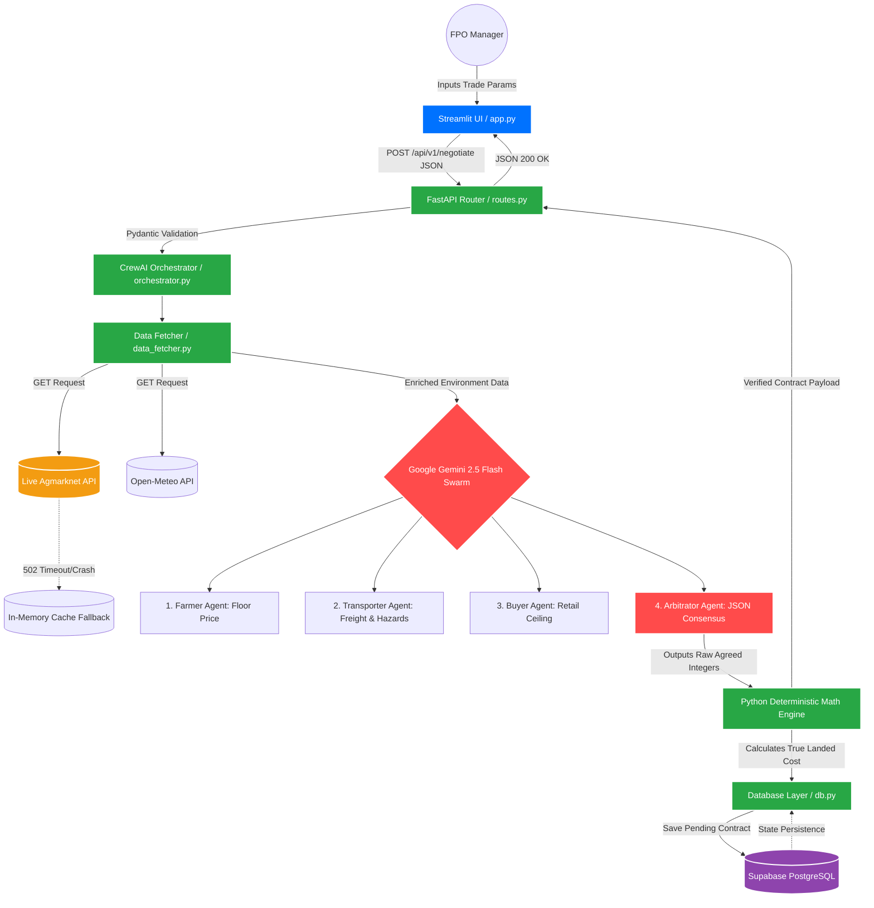

```mermaid
graph TD
    %% Styling
    classDef ui fill:#0072ff,stroke:#fff,stroke-width:2px,color:#fff;
    classDef api fill:#28a745,stroke:#fff,stroke-width:2px,color:#fff;
    classDef ai fill:#ff4b4b,stroke:#fff,stroke-width:2px,color:#fff;
    classDef data fill:#f39c12,stroke:#fff,stroke-width:2px,color:#fff;
    classDef db fill:#8e44ad,stroke:#fff,stroke-width:2px,color:#fff;

    %% Client Layer
    User((FPO Manager)) -->|Inputs Trade Params| UI[Streamlit UI / app.py]
    UI:::ui -->|POST /api/v1/negotiate JSON| Router[FastAPI Router / routes.py]
    
    %% API & Orchestration
    Router:::api -->|Pydantic Validation| Orchestrator[CrewAI Orchestrator / orchestrator.py]
    
    %% External Data Fetching
    Orchestrator:::api --> Fetcher[Data Fetcher / data_fetcher.py]
    Fetcher:::api -->|GET Request| Agmarknet[(Live Agmarknet API)]
    Agmarknet:::data -.->|502 Timeout/Crash| Cache[(In-Memory Cache Fallback)]
    Fetcher -->|GET Request| Weather[(Open-Meteo API)]
    
    %% Agent Swarm
    Fetcher -->|Enriched Environment Data| AgentSwarm{Google Gemini 2.5 Flash Swarm}
    AgentSwarm:::ai --> F_Agent[1. Farmer Agent: Floor Price]
    AgentSwarm --> T_Agent[2. Transporter Agent: Freight & Hazards]
    AgentSwarm --> B_Agent[3. Buyer Agent: Retail Ceiling]
    AgentSwarm --> A_Agent[4. Arbitrator Agent: JSON Consensus]
    
    %% Deterministic Math & Storage
    A_Agent:::ai -->|Outputs Raw Agreed Integers| MathGuard[Python Deterministic Math Engine]
    MathGuard:::api -->|Calculates True Landed Cost| DB_Link[Database Layer / db.py]
    DB_Link:::api -->|Save Pending Contract| Supabase[(Supabase PostgreSQL)]
    
    %% Return to Client
    MathGuard -->|Verified Contract Payload| Router
    Router -->|JSON 200 OK| UI
    Supabase:::db -.->|State Persistence| DB_Link
```
